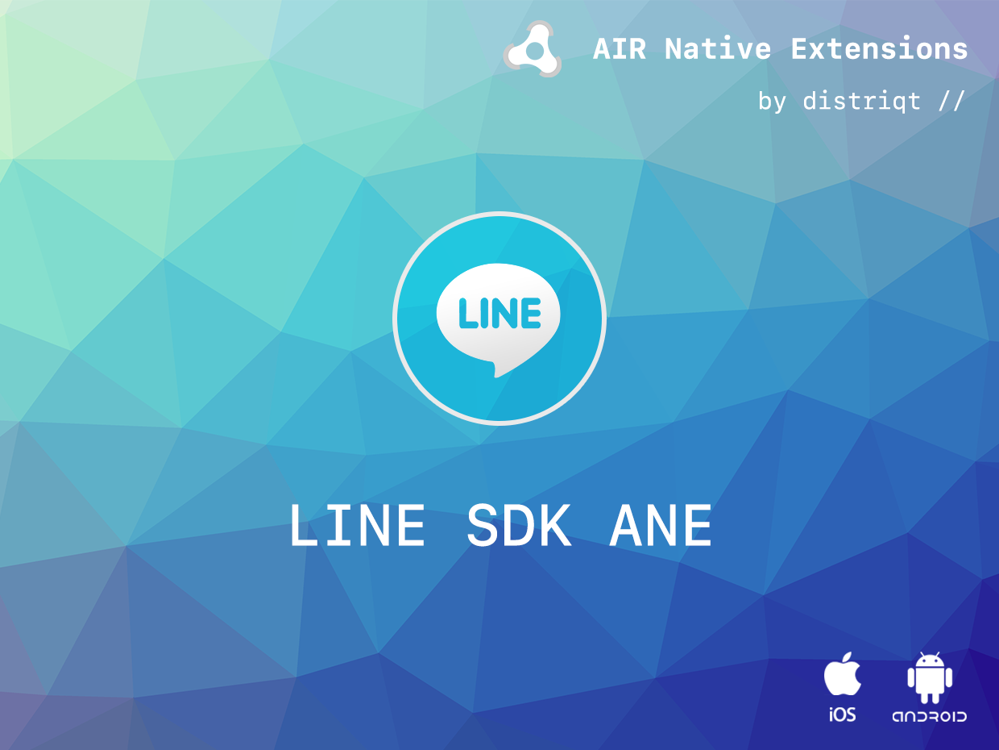
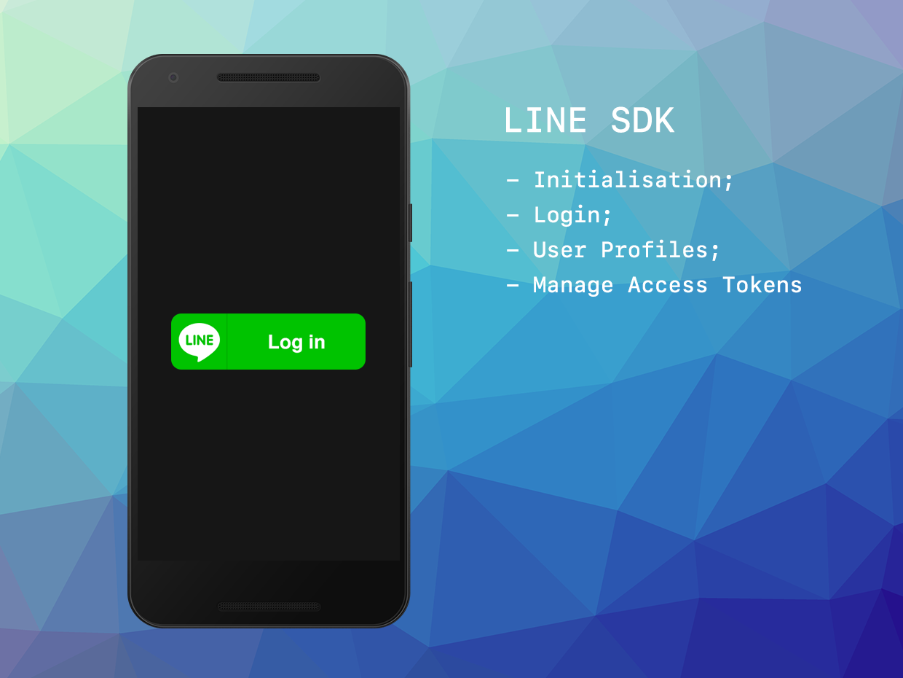

built by [distriqt //](https://airnativeextensions.com) 



# LineSDK

LineSDK is an AIR Native Extension to access the LINE platform including LINE Login.


LINE Login lets people easily create an account for your app or website using their LINE accounts. You can integrate LINE Login into your iOS, Android, or web app.

Add LINE Login to your iOS or Android app to let LINE handle the task of authenticating users. When users are logged in to LINE on their iOS or Android device, they are able to log in to your app without entering their email address and password. 

Developer community:

https://www.line-community.me/


Developer documentation:

https://developers.line.me/en/docs/


#### Features

- LINE Login
- Single API interface - your code works across supported platforms with no modifications
- Sample project code and ASDocs reference


## Documentation

Latest documentation can be found in the [wiki](https://github.com/distriqt/ANE-LineSDK/wiki)

Quick Example: 

```as3
```

More information: 

- Developer community: https://www.line-community.me/
- Developer documentation: https://developers.line.me/en/docs/





