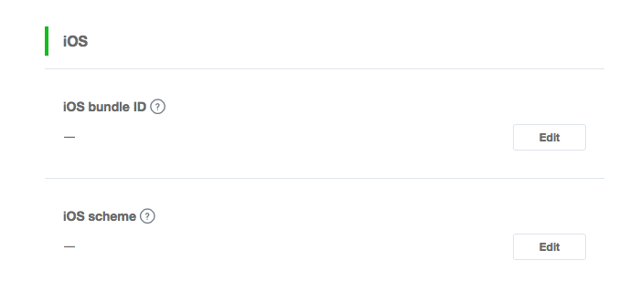
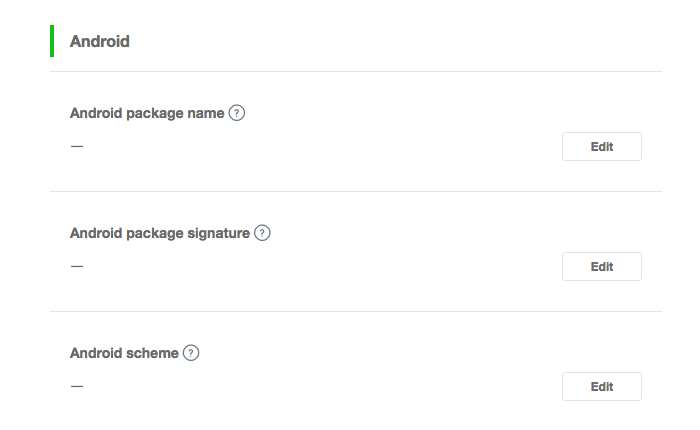

## Add the Extension

First step is always to add the extension to your development environment. 
To do this use the tutorial located [here](https://airnativeextensions.github.io/tutorials/getting-started).


## Required ANEs

### Core ANE

The Core ANE is required by this ANE. You must include this extension in your application and call the initialisation function at some point, generally at the same time as the initialisation of this extension. If you are using other extensions that also require the Core ANE, you only need to initialise it once, generally before initialising the other extensions.

```as3
Core.init();
```

The Core ANE doesn't provide any functionality in itself but provides support libraries and frameworks used by our extensions.
It also includes some centralised code for some common actions that can cause issues if they are implemented in each individual extension.

You can access this extension here: [https://github.com/distriqt/ANE-Core](https://github.com/distriqt/ANE-Core).


### Android Support ANE

Due to several of our ANE's using the Android Support library the library has been separated 
into a separate ANE allowing you to avoid conflicts and duplicate definitions.
This means that you need to include the some of the android support native extensions in 
your application along with this extension. 

You will add these extensions as you do with any other ANE, and you need to ensure it is 
packaged with your application. There is no problems including this on all platforms, 
they are just **required** on Android.

This ANE requires the following Android Support extensions:

- [com.distriqt.androidsupport.V4.ane](https://github.com/distriqt/ANE-AndroidSupport/raw/master/lib/com.distriqt.androidsupport.V4.ane)
- [com.distriqt.androidsupport.AppCompatV7.ane](https://github.com/distriqt/ANE-AndroidSupport/raw/master/lib/com.distriqt.androidsupport.AppCompatV7.ane)
- [com.distriqt.androidsupport.CustomTabs.ane](https://github.com/distriqt/ANE-AndroidSupport/raw/master/lib/com.distriqt.androidsupport.CustomTabs.ane)

You can access these extensions here: [https://github.com/distriqt/ANE-AndroidSupport](https://github.com/distriqt/ANE-AndroidSupport).

>
> **Note**: if you have been using the older `com.distriqt.AndroidSupport.ane` you should remove that
> ANE and replace it with the equivalent `com.distriqt.androidsupport.V4.ane`. This is the new 
> version of this ANE and has been renamed to better identify the ANE with regards to its contents.
>


## Extension IDs

The following should be added to your extensions node in your application descriptor to identify all the required ANEs in your application:

```xml
<extensions>
    <extensionID>com.distriqt.LineSDK</extensionID>

    <extensionID>com.distriqt.Core</extensionID>
    <extensionID>com.distriqt.androidsupport.V4</extensionID>
    <extensionID>com.distriqt.androidsupport.AppCompatV7</extensionID>
    <extensionID>com.distriqt.androidsupport.CustomTabs</extensionID>
</extensions>
```


---

## iOS

Make sure you have  for your app before proceeding.


### Configuring your channel

To link your app with your channel, complete the following fields in the "App settings" page of the console.

- **iOS bundle ID**: Bundle identifier of your app found in the “General” tab in your Xcode project settings. Must be lowercase. For example, `com.example.app`. You can specify multiple bundle identifiers by entering each one on a new line.

- **iOS scheme**: Set as `line3rdp.` followed by the bundle identifier. For example, if your bundle identifier is `com.example.app`, set the iOS scheme as `line3rdp.com.example.app`. Only one iOS scheme can be specified.




### Info Additions and Entitlements

The LINE SDK require a few additions to the Info plist and Entitlements section of your application to correctly configure your application.

You must replace the `BUNDLE_SEED_ID` and `BUNDLE_IDENTIFIER` with the information you gathered when setting up your application in the Apple developer center, and the `LINE_CHANNEL_ID` with your channel id from the channel you setup in the Line Dashboard.


The `BUNDLE_SEED_ID` is also called the **App ID Prefix**, or **Team ID** and is of the form `XXXXXXXXX`. You find it in the developer center: https://developer.apple.com/account/#/membership/ .

The `BUNDLE_IDENTIFIER` is the **App ID** and should be the same as your air application id.


```xml
<iPhone>
    <InfoAdditions><![CDATA[
        <key>LineSDKConfig</key>
        <dict>
            <key>ChannelID</key>
            <string>LINE_CHANNEL_ID</string>
        </dict>

        <key>CFBundleURLTypes</key>
        <array>
            <dict>
                <key>CFBundleTypeRole</key>
                <string>Editor</string>
                <key>CFBundleURLSchemes</key>
                <array>
                    <string>line3rdp.BUNDLE_IDENTIFIER</string>
                </array>
            </dict>
        </array>
        <key>LSApplicationQueriesSchemes</key>
        <array>
            <string>lineauth</string>
            <string>line3rdp.BUNDLE_IDENTIFIER</string>
        </array>
    )></InfoAdditions>
    <requestedDisplayResolution>high</requestedDisplayResolution>
    <Entitlements>
        < for your app before proceeding.


### Configuring your channel

To link your app with your channel, complete the following fields in the "App settings" page of the console.

- **Android package name**: Required. Application's package name used to launch the Google Play store.
- **Android package signature**: Optional. You can set multiple signatures by entering each one on a new line.
- **Android scheme**: Optional. Custom URL scheme used to launch your app.





### Manifest Additions

You must add the following manifest additions. You must include the `INTERNET` permission and the two LINE SDK activities.
The LINE SDK is only supported on Android API v15 and higher so you will need to make sure the minimum sdk version is set to 15 or higher.

```xml
<manifest android:installLocation="auto" >
    <uses-sdk android:minSdkVersion="15" android:targetSdkVersion="27" />

    <uses-permission android:name="android.permission.INTERNET"/>
    
    <application android:hardwareAccelerated="true">

        <activity
            android:name="com.linecorp.linesdk.auth.internal.LineAuthenticationActivity"
            android:configChanges="orientation|screenSize|keyboardHidden"
            android:exported="false"
            android:launchMode="singleTop"
            android:theme="@style/LineSdk_AuthenticationActivity" />

        <activity
            android:name="com.linecorp.linesdk.auth.internal.LineAuthenticationCallbackActivity"
            android:configChanges="orientation|screenSize|keyboardHidden"
            android:exported="true" >
            <intent-filter>
                <action android:name="android.intent.action.VIEW" />
                <category android:name="android.intent.category.DEFAULT" />
                <category android:name="android.intent.category.BROWSABLE" />
                <data android:scheme="lineauth" />
            </intent-filter>
        </activity>

    </application>

</manifest>
```


