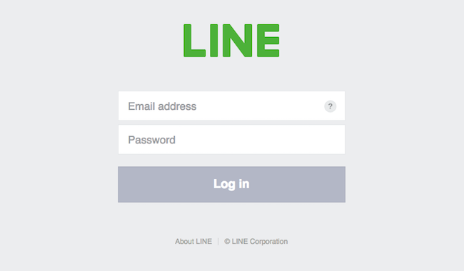
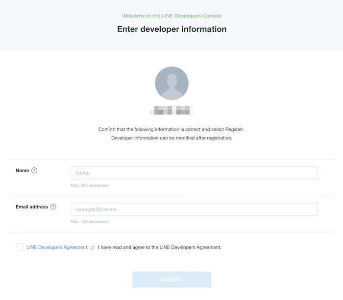
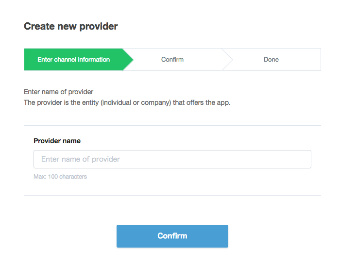
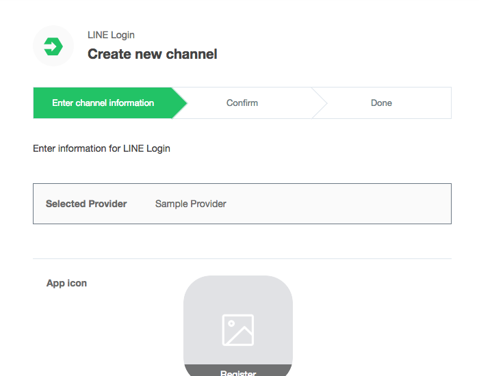
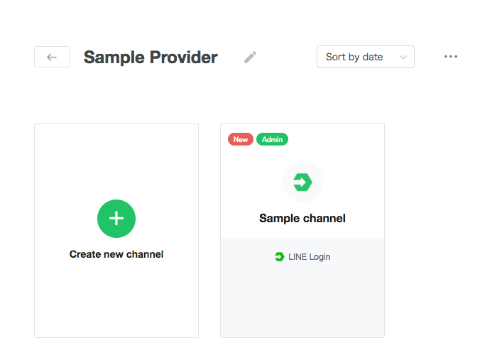

## Getting started with LINE Login

To start using LINE Login, you must first create a channel on the [LINE Developers console](https://developers.line.me/console/).

>
> ### What's a channel?
>
> To use the LINE platform, your application must be linked to a **channel**. When a channel is created, a unique **channel ID** is issued to identify the channel. Channels must have a name, description, and icon image.
>
>

## Creating a channel

### Step 1: Log in to the console

Log in to the LINE Developers console with the email address and password of your LINE account.

Note: If you do not have a LINE account with a registered email address, [download LINE](https://line.me/), then go to Settings > Account to register your email address.

[Log in to console](https://developers.line.me/console/register/line-login/provider/)

### Step 2: Register as a developer (only on first login)

Enter your name and email address to create a developer account on the LINE Developers console.

### Step 3: Create a new provider

Enter a name for the provider. The provider is the entity that offers your app. For example, you can use your own name or the name of your company.

### Step 4: Create a channel

Enter the required information for your channel. "LINE" or a similar string cannot be included in the channel name.

### Step 5: Confirm

Confirm that your channel was created.

